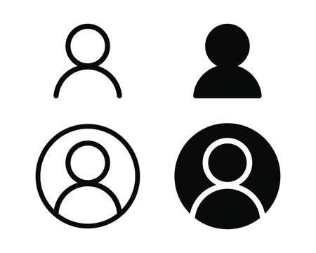

## **8-Man Group Proejct**
Working on an eight-person group project to develop a data auditing platform was a significant learning experience, particularly in the realm of backend development. My role involved designing and implementing the database schema to store complex financial data. Although we managed to deliver a functional system, it fell short of our initial vision due to several missing features.

## **Challenges of Design**
One of the key challenges I faced was determining the best approach for handling calculations. Initially, I used autoValue functions in SimpleSchema to calculate totals, such as revenue and expenses, directly within the database schema. This method ensured data consistency and reduced redundant calculations during queries, but it also added complexity to the schema and made maintenance more difficult. To mitigate this, I explored an alternative approach by making the calculations in application logic. While this simplified the schema, it required additional steps to ensure data accuracy before storage. This comparison provided valuable insights into balancing performance and maintainability, especially in systems where accuracy and scalability are paramount.

## **Challenges of Collaboration**
The technical aspects of the project were rewarding, but they also highlighted the tradeoffs involved in backend design. However, the most significant challenge was the uneven contribution from some team members. Despite clear role assignments and regular meetings, a few members did not engage with their tasks, leaving the bulk of the workload to the rest of us. This was particularly frustrating as deadlines approached and key components remained incomplete. It became evident that individual interest in the project directly influenced motivation. Team members who found the project engaging put in significant effort, while others struggled to stay involved. This lack of engagement resulted in slow and disjointed progress, leading to several unfinished features due to time constraints and uneven contributions. The final product, although functional, lacked key functionality and felt incomplete.

## **What I Leared**
While it was disheartening to see our initial vision diminish, the project offered valuable learning opportunities. I realized that technical skills alone are insufficient for success; clear communication, accountability, and shared interest are equally crucial. Despite the frustrations, the project was a valuable experience. It allowed me to experiment with backend design, learn from mistakes, and understand the dynamics of group collaboration.
