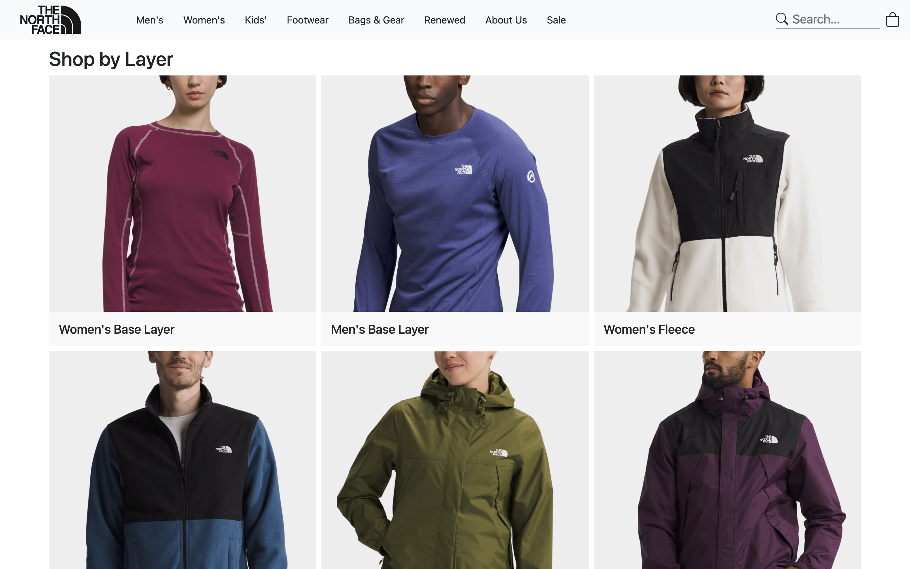

## **UI Frameworks**
UI frameworks, at first glance, might look like an additional layer of complexity and creating websites from scratch using raw HTML and CSS might seem like an easier route. However, the main reason for using UI frameworks is proven by its efficiency, consistency and a guarantee of a user friendly experience. One of the main advantages of UI frameworks, such as Bootstrap 5, is quick development. With the responsive grid system and library of pre-designed components, Bootstrap 5 gives developers the tools to create polished and user-friendly interfaces with ease. The development process capability not only reduces time and effort but also creates a foundation that can be built upon for specific project requirements. Consistency across projects is another reason to use UI frameworks. By using a predefined set of rules, classes and components, developers can ensure a consistent and professional look and feel across different projects. This not only enhances the user experience but also reduces workload by having things work across different platforms.

## **My Experience**
As someone with limited experience with UI frameworks and website building in general, my first step into Bootstrap 5 was filled with challenges and success. The sheer volume of new keywords, classes and concepts presented a giant learning curve that left me scratching my head when I ran into errors. But with the documentation, and practice material, I started to implement Bootstrap 5 features in my projects, and the challenges started to become overshadowed by the benefits. 

The grid system in Bootstrap 5 proved to be excellent and easy to use. Its flexibility allowed me to create responsive layouts effortlessly, even without fully understanding it. Embracing the card system simplified the implementation of images and text, while also making it visually appealing. Despite the initial learning curve, the end results of my projects became easier to implement and easy on the eyes. 

## **Bootstrap 5 Example**
As an example, in one of my projects for my software engineering course, I was tasked with recreating a website using Bootstrap 5. For this project, I chose to recreate The North Face store page. With the Bootstrap grid system I was able to make fluid and properly sectioned elements of the page. Alongside the grid system, I used the card system that seamlessly combined text and images into one cohesive and organized element. The predefined layouts and example code in the documentation greatly reduced the time and effort required to implement these features.

  

    

      

        
        

          <h5 class="card-text">Main image card</h5>
        

      

    

    

      

        
        

          <h5 class="card-text">Grid system with cards</h5>
        

      

    

  

## **Final thoughts**
In the landscape of UI frameworks, Bootstrap 5 emerges as a potent tool for those seeking to enhance their web development projects. The initial learning curve is understandably challenging, yet the long-term advantages in terms of coding for efficiency, consistency and enhanced user experience validate the investment. From my limited experience, the surface level tools used stand as a testament to the depth and level of how much more Bootstrap can offer for efficient and visually appealing web applications. 

